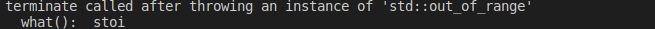

# 字符串转整形

**首先atoi和strtol都是c里面的函数，他们都可以将字符串转为int，它们的参数都是const char*，*因此在用string时，必须调c_str()方法将其转为char的字符串 。**

三个测试字符串。

```c++
string str1 = "asq,";
string str2 = "12312";
string str3 = "3276868343221";
```


- atoi 相对简单，只对字符串简单判断，如果第一个字符是非法字符，返回0，如果前面是有效
  数值，返回前面的数值，后面非法的不返还。

- ato-x 不会检测错误，也就是errno，而strto-x函数则会触发errno变化

  ```c++
  int f = atoi(str3.c_str());
  ```

  输出f的值为**-191703627**，很显然对于超过范围的值，atol并未报错，而是进行相应的转换

- strtol将字符串转换为长整数，base为进制数， 且能自定义转换的string字符串的类型（进制类型）， 如果转换成功，endptr指向字符串首地址，反之，则指向第一个非法字符。

  ```c++
  int e = strtol(str1.c_str(), &pend, 10);
  ```

​		输出的值为**0**，即当遇到非数字字符串时，直接输出0。同ato-x越界不会报错

- ***stoi为c++中的函数，他相较于前者，在面对超出数据类型范围的数字时会报错***

  ```c++
  int d = stoi(str3); // 报异常
  ```

  很显然，报错如下图所示

  

